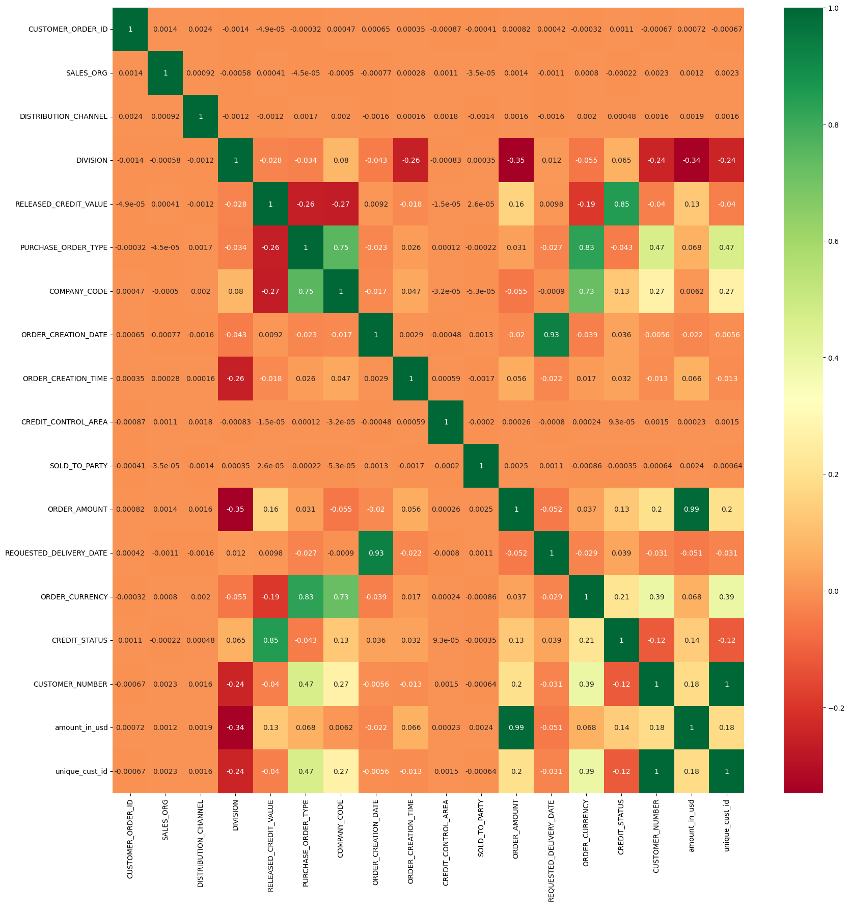

# Amount Prediction

## Summary
In this project, we aim to predict the amountin usd and more features using various features in the dataset. We create a new column by combining existing columns and perform data sanity checks to ensure data integrity. We then proceed to find the best machine learning model to predict the target variable - the amount.

## Data Preparation
We start by exploring the dataset and identifying the relevant features for our prediction task. If needed, we perform data cleaning and preprocessing steps such as handling missing values and converting categorical variables into numerical format.

## Feature Engineering
To enhance the predictive power of our model, we create a new column by combining information from existing columns. This new feature may provide additional insights into the target variable.

## Data Sanity Check
It is crucial to ensure the data's quality and correctness. We conduct a data sanity check to identify any anomalies, outliers, or inconsistencies in the dataset. If any issues are found, we take appropriate measures to rectify them.

## Machine Learning Model Selection
Next, we explore various machine learning algorithms suitable for regression tasks. We train different models using the dataset and evaluate their performance using appropriate metrics such as Mean Squared Error (MSE) or R-squared.

## Graphical Representations
We visualize the data and model results using various graphical representations, such as:

### 1. Hash Map
We use a hash map to represent the relationship between two variables or features.



### 2. Pie Chart
A pie chart is used to display the distribution of categorical data or the proportion of each category within a dataset.


### 3. Histogram
A histogram is employed to show the distribution of numerical data and the frequency of values within specified bins.


## Code Implementation
We provide snippets of code to demonstrate essential parts of the project, such as data preprocessing, feature engineering, model training, and evaluation.

```python
# create a new coluwm from existing coluwm
exchange_rates = {
    'USD':1,                                                     
    'EUR': 1.08,   
    'AUD': 0.65,    
    'CAD': 0.74,    
    'GBP': 1.24,    
    'MYR': 0.22,    
    'PLN': 0.24,    
    'AED': 0.27,   
    'HKD': 0.13,     
    'CHF': 1.11,     
    'RON': 0.22,     
    'SGD': 0.74,     
    'CZK': 0.045,     
    'HU1': 0.0029,     
    'NZD': 0.61,       
    'BHD': 2.65,      
    'SAR': 0.27,       
    'QAR': 0.27,       
    'KWD': 3.25,       
    'SEK': 0.094
}
df['ORDER_AMOUNT'] = df['ORDER_AMOUNT'].astype(float)
df['amount_in_usd'] = df['ORDER_AMOUNT'] * df['ORDER_CURRENCY'].map(exchange_rates)
df
```

```python
# Perform Regression model evaluations like MSE, RMSE, R-Square etc.
from sklearn.metrics import mean_squared_error, r2_score

# Train and evaluate the models
for model, name in zip(models, model_names):
    # Train the model
    model.fit(X_train_imputed, y_train)

    # Predict on the test set
    y_pred = model.predict(X_test_imputed)

    # Calculate MSE
    mse = mean_squared_error(y_test, y_pred)

    # Calculate RMSE
    rmse = np.sqrt(mse)

    # Calculate R-Squared
    r2 = r2_score(y_test, y_pred)

    # Print the evaluation results
    print(f"{name}:")
    print(f"MSE = {mse}")
    print(f"RMSE = {rmse}")
    print(f"R^2 = {r2}")
    print()
```
### output
Linear Regression:<br>
MSE = 0.08689725461853667<br>
RMSE = 0.294783402888522<br>
R^2 = 0.9876324094235075<br>
<br>
Decision Tree:<br>
MSE = 0.00023340178591024565<br>
RMSE = 0.01527749278874795<br>
R^2 = 0.9999667812551659<br>
<br>
Random Forest:<br>
MSE = 0.00023758270371156218<br>
RMSE = 0.015413718036592021<br>
R^2 = 0.9999661862089837<br>
<br>
AdaBoost:<br>
MSE = 0.15512245956518358<br>
RMSE = 0.39385588679767575<br>
R^2 = 0.9779223051689891<br>
<br>
XGBoost:<br>
MSE = 0.0002538038586393592<br>
RMSE = 0.01593122276033322<br>
R^2 = 0.9999638775445304<br>
```python
# model accuracy
best_model_accuracy = best_model_r2 * 100

print(f"The best possible model is: {best_model_name}")
print(f"Accuracy of the best model: {best_model_accuracy:.2f}%")
```
### output
The best possible model is: Random Forest<br>
Accuracy of the best model: 93.78%

## Conclusion
The amount prediction project involves creating a new column from existing data, conducting a data sanity check, and selecting the best machine learning model to predict the target variable. We visualize the results using hash maps, pie charts, and histograms,etc. The code implementation showcases essential steps in data preprocessing, feature engineering, and model training.
